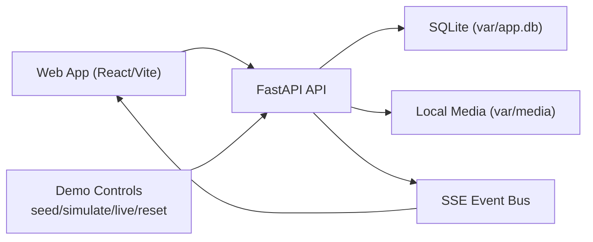
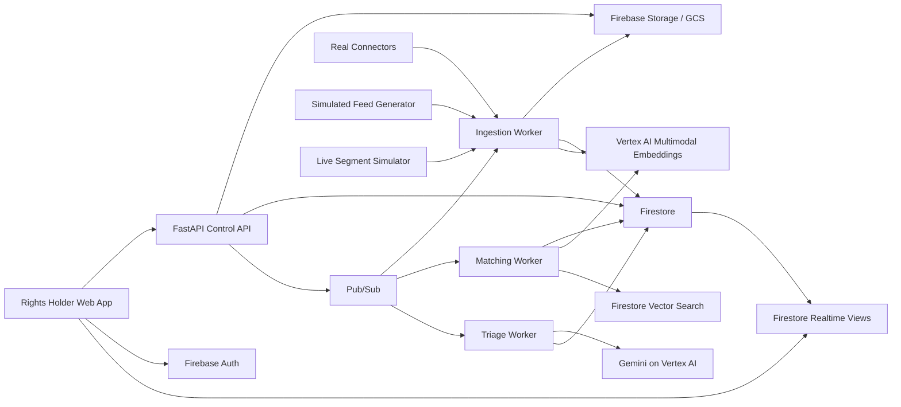

# KillCont Architecture

## Architecture Goal

Build a hackathon-friendly architecture that feels scalable, is easy to explain, and does not require custom model training.

## Current Runtime Architecture (Implemented)

The branch currently runs a local-first MVP profile:

- React + Vite web client
- FastAPI control API
- SQLite metadata store (`apps/api/var/app.db`)
- Local media storage (`apps/api/var/media`)
- Demo bearer-token auth
- Environment-selectable auth backend (`demo` or `firebase`)
- SSE event bus for live UI updates



## Local To Cloud Migration Path

The implemented MVP behavior stays the same while infrastructure adapters change:

1. Keep route contracts stable.
2. Replace SQLite repositories with Firestore repositories.
3. Replace local file storage with Cloud Storage.
4. Keep selectable auth backend and enable Firebase token acquisition path in frontend.
5. Deploy API to Cloud Run and web to Firebase Hosting.

## Core Architectural Principle

Separate the system into five clear layers:

1. Identity and operator access
2. Asset registration and provenance
3. Monitoring and ingestion
4. Matching and incident intelligence
5. Realtime dashboard and actions

## Target Public Cloud Architecture



## Why This Shape Works

- Each part has one main responsibility.
- The backend can evolve without changing the frontend contract too much.
- Realtime updates are supported in both profiles: SSE in local mode and Firestore listeners in cloud mode.
- AI tasks run asynchronously, which keeps the UI responsive.
- The architecture supports both image and video without becoming two separate products.

## Main Services

### 1. Web Client

Responsibilities:

- Google sign-in
- upload official media
- browse assets
- review incidents
- monitor live feed
- use maps and timeline views
- trigger operator actions

Recommended responsibilities to keep in client only:

- auth session handling
- light validation
- optimistic UI state
- playback and visualization

Do not put in client:

- privileged cloud credentials
- long-running media processing
- trust or similarity scoring logic

### 2. Control API

Responsibilities:

- authenticated endpoints
- asset creation
- ingestion orchestration
- incident updates
- action endpoints
- serving signed upload instructions if needed

Suggested FastAPI domains:

- auth/session utilities
- organizations
- assets
- feed-items
- incidents
- actions
- live-monitoring
- admin/demo

### 3. Storage Layer

Use:

- Firebase Storage / GCS for media files, thumbnails, evidence, and demo clips
- Firestore for metadata, incidents, event summaries, operator notes, and realtime state

Store in Firestore:

- user profile
- organization profile
- asset records
- provenance summaries
- feed item records
- match candidates
- incidents
- action history
- map events
- dashboard counters

Store in Storage:

- official uploads
- extracted keyframes
- normalized monitor captures
- segment thumbnails
- evidence exports

### 4. Event Layer

Use Pub/Sub for:

- asset uploaded
- feed item captured
- embedding ready
- similarity candidate ready
- incident triage ready
- live segment detected

Why:

- It decouples ingestion from analysis.
- It makes it easier to retry and evolve workers.
- It creates a real event-driven story for judges.

### 5. AI Layer

Use Vertex AI for two tasks only:

- multimodal embeddings for similarity
- Gemini classification and summarization for incident triage

Keep the AI layer bounded:

- no training
- no fine-tuning
- no chain-heavy agent system
- no over-complicated orchestration

## Domain Model

### Asset

Represents an official media object registered by the rights holder.

Important fields:

- asset_id
- organization_id
- asset_type
- source_title
- sport_type
- event_name
- event_date
- upload_status
- provenance_status
- c2pa_status
- primary_storage_path
- preview_path
- embedding_status
- representative_embedding
- segment_index_status
- created_at

### Feed Item

Represents a monitored external piece of content.

Important fields:

- feed_item_id
- source_type
- source_platform
- source_url
- source_author
- source_region
- content_type
- capture_mode
- preview_path
- normalized_media_path
- caption_text
- publish_time
- ingest_time
- embedding_status

### Match Candidate

Represents a potential similarity relationship.

Important fields:

- candidate_id
- feed_item_id
- asset_id
- similarity_score
- temporal_overlap_score
- confidence_band
- matched_frames
- match_strategy
- provenance_gap
- created_at

### Incident

Represents an actionable event shown to operators.

Important fields:

- incident_id
- asset_id
- feed_item_id
- severity
- incident_type
- triage_label
- triage_reason
- operator_status
- trust_score
- spread_score
- evidence_pack_status
- map_coordinates
- created_at
- updated_at

## Suggested Firestore Collections

```text
organizations/{orgId}
users/{userId}
assets/{assetId}
assets/{assetId}/segments/{segmentId}
feedItems/{feedItemId}
matchCandidates/{candidateId}
incidents/{incidentId}
incidents/{incidentId}/events/{eventId}
actions/{actionId}
dashboardSnapshots/{snapshotId}
demoScenarios/{scenarioId}
```

## Matching Pipeline

### Image Path

1. Official image is uploaded.
2. Backend registers metadata.
3. Worker creates preview and embedding.
4. Embedding is stored on the asset record.
5. Monitored image arrives.
6. Worker normalizes the media.
7. Worker creates a monitored embedding.
8. Similarity query runs.
9. Candidate thresholding and triage run.
10. Incident appears in Firestore.

### Video Path

1. Official video is uploaded.
2. Backend registers metadata.
3. Worker generates preview, basic metadata, and keyframes.
4. Worker creates a video-level embedding.
5. Worker creates segment or keyframe embeddings for finer matching.
6. Monitored clip arrives.
7. Worker normalizes and samples frames or segments.
8. Coarse search narrows the candidate set.
9. Fine search compares segment-level similarity.
10. Triage worker creates an incident with explainable evidence.

### Live Segment Path

1. A simulated live source emits short segments on a timer.
2. Each segment is ingested like a feed item.
3. Segment embeddings are compared against the event watchlist.
4. Matching segments form a live incident thread.
5. The dashboard updates latency, spread, and risk indicators in real time.

## Matching Logic

Use a two-stage strategy:

- coarse semantic retrieval
- fine evidence scoring

Coarse retrieval inputs:

- video-level embedding
- image embedding
- asset type filter
- organization filter

Fine evidence scoring inputs:

- frame-level similarity
- segment overlap
- metadata alignment
- provenance presence or absence
- source reputation
- spread velocity

This produces:

- trust score
- severity
- triage label

## Provenance Layer

KillCont should treat provenance as a first-class signal, not a decorative badge.

Suggested statuses:

- verified_credential_present
- credential_present_but_partial
- credential_missing
- credential_removed_suspected
- provenance_not_checked

Use cases:

- mark official assets as protected
- explain why a suspicious re-upload is severe
- strengthen evidence packaging

## Triage Model

Gemini should not decide legality.

Gemini should do bounded product tasks:

- summarize what happened
- classify likely intent
- suggest severity band
- generate concise operator notes

Input bundle:

- matched asset metadata
- feed item metadata
- similarity evidence
- caption text
- source platform
- provenance status

Output structure:

- label: ignore | monitor | strike
- reason_short
- reason_detailed
- operator_copy
- confidence_note

## Realtime Dashboard Pattern

Do not poll aggressively.

Instead:

- run analysis asynchronously
- write state to Firestore
- let the frontend subscribe to incident and dashboard collections

This gives:

- visible “live” behavior
- simpler frontend state
- less API complexity

## Threat Map Pattern

The map should consume incident documents enriched with:

- country
- region
- city when available
- platform
- severity
- asset cluster
- spread velocity

Visual layers:

- active incident points
- clustered hotspots
- animated propagation arcs
- selected incident route

Important note:

- Prefer modern map layers and clusters over legacy heatmap-only designs.

## Security Model

### Auth

- Firebase Authentication with Google sign-in
- Restrict access to demo organization roles

### Authorization

- API verifies Firebase tokens
- Firestore rules limit org data access
- Storage rules limit upload and read paths

### Sensitive Material

- Official assets should not be publicly readable by default.
- Only previews intended for the dashboard should be exposed through controlled URLs.

## Performance Strategy

### UX Targets

- Login to dashboard shell under 2 seconds on demo hardware
- Upload acknowledgement under 2 seconds
- Incident list refresh through realtime updates within 1 second of write visibility
- Asset detail navigation under 300 milliseconds after data is loaded
- Map interaction smooth at 60fps for demo-scale event counts

### Backend Targets

- Ingestion endpoints respond fast and offload heavy work
- Media normalization is asynchronous
- Similarity lookups stay under 500 milliseconds for demo datasets

## Fallback Strategy

If time is short:

- keep one real connector
- keep one simulated connector
- keep one simulated live source
- reduce provenance to verification badge and metadata panel
- keep enforcement as operator recommendation rather than full automation

## Suggested API Surface

### Auth / Session

- `GET /session/me`

### Assets

- `POST /assets`
- `GET /assets`
- `GET /assets/{asset_id}`
- `POST /assets/{asset_id}/provenance/check`
- `POST /assets/{asset_id}/watch`

### Feed

- `POST /feeds/ingest`
- `GET /feeds`
- `GET /feeds/{feed_item_id}`

### Incidents

- `GET /incidents`
- `GET /incidents/{incident_id}`
- `POST /incidents/{incident_id}/status`
- `POST /incidents/{incident_id}/action`

### Demo

- `POST /demo/scenarios/{scenario_id}/seed`
- `POST /demo/live/start`
- `POST /demo/live/stop`

## Deployment Shape

Recommended demo deployment shape:

- frontend on Firebase Hosting or similar static host later
- FastAPI service on Cloud Run
- worker endpoints on Cloud Run
- Firestore and Storage in the same project
- Vertex AI in the same project

No CI/CD is planned for this hackathon build.

Manual deploys are acceptable.

## Why Judges Will Understand This Architecture

- It is easy to narrate.
- It maps cleanly to the product screens.
- It uses Google Cloud meaningfully instead of gratuitously.
- It looks scalable without becoming over-engineered.
